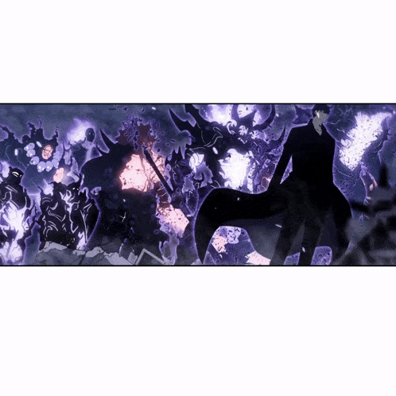

<!-- Profile README for github.com/VarnoxL -->

<div align="center">




<p>


</p>

</div>

---

<div align="center">

<table width="100%">
<tr>
<td align="center" width="50%"><b>⟪ STATUS WINDOW ⟫</b></td>
<td align="center" width="50%"><b>⟪ CURRENT QUEST ⟫</b></td>
</tr>
<tr>
<td valign="top">

```
╔══════════════════════════════════════════════╗
║               HUNTER  PROFILE                ║
╠══════════════════════════════════════════════╣
║                                              ║
║  NAME    :  Daniel Liu                       ║
║  CLASS   :  Player                           ║
║  RANK    :  S                                ║
║  GUILD   :  Independent                      ║
║  WEAPON  :  Keyboard (+7)                    ║
║  TITLE   :  He Who Rises Again               ║
║                                              ║
╚══════════════════════════════════════════════╝
```

</td>
<td valign="top">

```
╔══════════════════════════════════════════════╗
║               ACTIVE  QUESTS                 ║
╠══════════════════════════════════════════════╣
║                                              ║
║  [■]  Show up every day. No skipped days.    ║
║  [■]  Keep building through the rejections.  ║
║  [ ]  Clear the next gate.                   ║
║  [ ]  Out-work last year's version of me.    ║
║                                              ║
║  REWARD  :  EXP + ∞                          ║
║  STATUS  :  IN PROGRESS                      ║
║                                              ║
╚══════════════════════════════════════════════╝
```

</td>
</tr>
</table>

</div>

---

<div align="center">

## ⟪ REAL-WORLD COORDINATES ⟫

🎓 **Computer Engineering** @ Southern Illinois University Edwardsville — Expected May 2029<br>
🚀 **Seeking:** Summer 2027 Software Engineering / Full-Stack internships<br>
🇺🇸 **Work Status:** U.S. Citizen — no sponsorship required<br>
📫 **danielliu070809@gmail.com**

</div>

---

<div align="center">

## ⟪ ARSENAL ⟫

### Languages


### Frameworks & Libraries


### Tools & Infrastructure


</div>

---

<div align="center">

## ⟪ GATE ACCESS ⟫

<a href="https://www.linkedin.com/in/daniel-liu-171b89381">
  
</a>
<a href="mailto:danielliu070809@gmail.com">
  
</a>

<br><br>


<br><br>

### `"I alone level up."`

**⚔️ ARISE. ⚔️**

</div>
